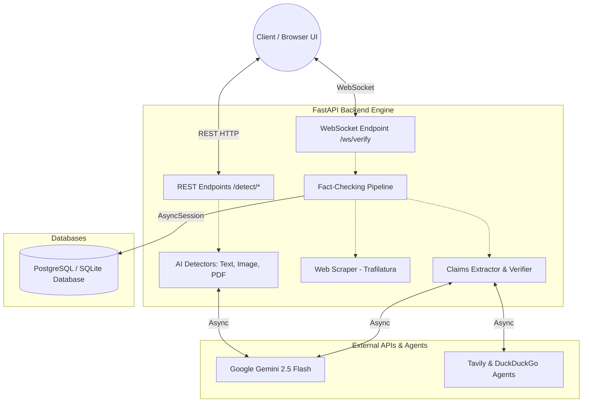

# 🛡️ AI Generated Content Detection Engine

An open-source, highly concurrent AI fact-checking pipeline and synthetic content detection engine built with FastAPI, Google Gemini API, WebSockets, and real-time web search agents.

---

## 🌐 Live Demo & Deployment

- **Live Web Application:** [https://ai-claim-verification.onrender.com](https://ai-claim-verification.onrender.com)
- **Interactive API Documentation:** [https://ai-claim-verification.onrender.com/docs](https://ai-claim-verification.onrender.com/docs)
- **GitHub Repository:** [https://github.com/udaynarayansingh725/Ai-Claim-Verification](https://github.com/udaynarayansingh725/Ai-Claim-Verification)

---

## 🚀 Key Features

- **Real-Time Fact-Checking Pipeline (WebSocket):** Analyzes raw text or news article URLs, scrapes content, extracts verifiable claims using Gemini 2.5 Flash, searches the web concurrently using Tavily & DuckDuckGo agents, and streams truthfulness verdicts in real-time.
- **AI Content Detection Engine (REST API):** Dedicated endpoints to analyze text, images (PNG/JPG), and multi-page PDF documents for AI generation artifacts and synthetic signatures.
- **Interactive Web Dashboard:** Built-in glassmorphic web interface with real-time WebSocket progress bars, claim cards, confidence scores, and source citation links.
- **Async & Multi-threaded Architecture:** Uses Python `asyncio` and thread pools to run web scraping, claim extraction, and evidence verification concurrently.
- **Production Ready:** Dockerized with official `Dockerfile` and Render configuration (`render.yaml`).

---

## 🛠️ Tech Stack & Architecture

- **Backend Framework:** FastAPI (REST + WebSockets)
- **AI / LLM Engine:** Google Gemini API (`google-genai` SDK - `gemini-2.5-flash`)
- **Web Search Agents:** Tavily Async Search & DuckDuckGo Fallback
- **Database & ORM:** PostgreSQL / SQLite with Async SQLAlchemy & Alembic Migrations
- **Frontend UI:** HTML5, Tailwind CSS, FontAwesome, Native WebSockets

---

## ⚙️ Quick Start & Local Setup

### 1. Prerequisites
- Python 3.10+
- Git

### 2. Clone Repository
```bash
git clone https://github.com/udaynarayansingh725/Ai-Claim-Verification.git
cd Ai-Claim-Verification
```

### 3. Virtual Environment & Dependencies
```bash
# Create virtual environment
python -m venv venv

# Activate (Windows PowerShell)
.\venv\Scripts\Activate.ps1
# Activate (Mac/Linux)
source venv/bin/activate

# Install dependencies
pip install -r requirements.txt
```

### 4. Environment Variables (`.env`)
Create a `.env` file in the root directory:

```env
# Google Gemini API key for claim extraction and AI detection
GEMINI_API_KEY=your_gemini_api_key_here

# Tavily API key for robust web search
TAVILY_API_KEY=your_tavily_api_key_here

# PostgreSQL / SQLite database connection string
DATABASE_URL=sqlite+aiosqlite:///./factify.db

# Application settings
LOG_LEVEL=DEBUG
APP_ENV=development
```

### 5. Run Backend & Web Dashboard
```bash
uvicorn app.main:app --reload
```

Open your browser and navigate to **`http://127.0.0.1:8000`** to access the Web UI dashboard!

---

## 📡 API Endpoints Summary

| Method | Endpoint | Description |
| :--- | :--- | :--- |
| **WS** | `/ws/verify` | Real-time WebSocket streaming fact-checking pipeline |
| **POST** | `/detect/text` | Detect whether input text is human-written or AI-generated |
| **POST** | `/detect/image` | Upload image (PNG/JPG) to detect synthetic AI generation |
| **POST** | `/detect/pdf` | Upload PDF document (up to 10 pages) for AI analysis |
| **GET** | `/reports/{report_id}` | Fetch stored verification report by UUID |
| **DELETE** | `/reports/{report_id}` | Delete a stored report |
| **GET** | `/health` | API health check & uptime status |

---

## 🏗️ System Architecture Flow



---

## 🤝 Contributing

Contributions are always welcome! Feel free to open issues or submit pull requests to improve detection accuracy and feature coverage.

---

## 📄 License

This project is open-source under the MIT License.
