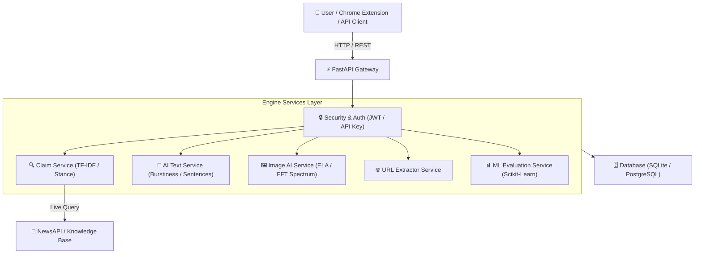

# Claim Verification & AI-Generated Content Detection Engine

[](https://github.com/udaynarayansingh725/Ai-Claim-Verification/actions)
[](https://ai-claim-verification.onrender.com/)

🌐 **Live Demo Application:** [https://ai-claim-verification.onrender.com/](https://ai-claim-verification.onrender.com/)  
📚 **Interactive Swagger API Docs:** [https://ai-claim-verification.onrender.com/docs](https://ai-claim-verification.onrender.com/docs)

Combines five advanced verification & analytics engines in one modern web application:
1. **Claim Verification** — claim → keywords extraction → evidence retrieval → stance classification (`AGREES`, `DISAGREES`, `NEUTRAL`) → verdict.
2. **URL Article Verification** — URL extraction → article body parsing → automated claim checking.
3. **AI Text Detection** — likelihood score with sentence-by-sentence highlight breakdown (burstiness, lexical diversity, repetition, connectives).
4. **AI Image Forensics** — likelihood score with interactive visual **Error Level Analysis (ELA) Heatmap** canvas & FFT frequency spectrum.
5. **ML Benchmark Evaluation & Analytics** — 50+ labeled benchmark sample evaluation comparing scikit-learn Logistic Regression vs Heuristic rules.

> ⓘ **Note on Probabilistic Nature:** Results are probabilistic first-level assessments based on signal extraction and evidence retrieval — not a replacement for expert human fact-checking.

---

## 🏗️ Architecture Diagram



---

## ⚡ API Quickstart & `curl` Examples

### 1. Verify a Factual Claim
```bash
curl -X POST "https://ai-claim-verification.onrender.com/api/verify-claim" \
     -H "Content-Type: application/json" \
     -d '{"claim": "Water boils at 100 degrees Celsius at sea level"}'
```

### 2. Detect AI-Generated Text
```bash
curl -X POST "https://ai-claim-verification.onrender.com/api/detect-text" \
     -H "Content-Type: application/json" \
     -d '{"text": "In today digital age, it is important to note that technology plays a crucial role. Furthermore, innovation drives progress."}'
```

### 3. Check System Health & Uptime
```bash
curl "https://ai-claim-verification.onrender.com/api/health"
```

---

## 🧩 Chrome Extension (Manifest V3)

The repository includes a complete **Chrome Extension** in the `chrome-extension/` folder.

### Installation Instructions:
1. Open Google Chrome and navigate to `chrome://extensions/`.
2. Enable **Developer mode** in the top-right toggle.
3. Click **Load unpacked** and select the [`chrome-extension`](chrome-extension/) folder.
4. Highlight any text on any webpage, right-click, and choose **"🔍 Verify Claim with VerifyEngine"**!

---

## 🐳 Docker & Docker Compose Deployment

Run the full production stack (FastAPI + PostgreSQL + Redis):
```bash
docker-compose up --build -d
```
App will be running at `http://localhost:8000`.

---

## ⚠️ Render Cold-Start Note
When using the free tier of Render, services spin down after periods of inactivity. If the service hasn't received traffic recently, the initial HTTP request may take **30-50 seconds** while the instance spins up. Subsequent requests respond instantly.

---

## 👨‍💻 Developer & Author
* **GitHub Profile:** [udaynarayansingh725](https://github.com/udaynarayansingh725)
* **Project Repository:** [Ai-Claim-Verification](https://github.com/udaynarayansingh725/Ai-Claim-Verification)
* **License:** MIT License
